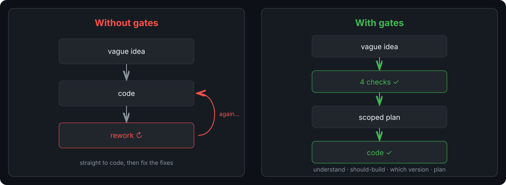

  
  <h1>Development Protocol</h1>
  
<strong>Stop your AI agent from coding the wrong thing</strong>

  
A step-by-step method that turns a vague idea into a scoped plan — what to build, whether to build it, and how — before any code gets written.

  

    
    
    
  

  
  

  Built with AI assistance — see <a href="./docs/CREDITS.md">CREDITS.md</a>
 

 

 
For builders and coding agents who run AI loops and want fewer reworks. Not for one-off prompts or code generation without review.

**In 15 seconds:** you ask `add dark mode`. The agent runs 4 checks: 1. understand what you actually want, 2. check whether it is worth building, 3. pick the best approach, 4. plan then execute. A full run with real decisions: [colour-blind trace](docs/traces/colour-blind-85-100.md) (mistakes kept in).

Quick links: [Try it](#try-it-in-5-steps) · [Proof](#proof-a-real-run) · [Pipeline](#the-pipeline-at-a-glance) · [Principles](#core-principles)

## The 4 checks

1. **Understand** what you actually want, including what you have not said yet.
2. **Should-build**: commit to the problem, schedule it, or drop it — before researching alternatives.
3. **Which version**: same, scaled, adjacent, or more — picked after looking at the landscape.
4. **Plan and build**: prototype, lock the plan, execute, verify, learn.

A person approves the strategy once, then the agent builds with checks along the way. (The step codes — P1, P2a, P2b, P3, P4 — live in `steps/QUICKSTART.md`; you do not need them to start.)

## Try it in 5 steps

1. Brain dump into `steps/INBOX.md`, then group similar thoughts and pick one to pursue.
2. Run `steps/EXTRACTION.md` on it: state the real problem in one sentence, separate from your first solution idea.
3. Run `steps/SERIOUSNESS.md`: score commitment honestly. Exit is COMMIT, SCHEDULE, or DROP. Only a COMMIT continues.
4. Run `steps/DECOMPOSITION.md`, `steps/AMBITION.md`, then `steps/LANDSCAPE.md`. End with a written choice of which version to build, then get human approval in `steps/STRATEGY.md`.
5. Prototype in `steps/VALIDATION.md`, lock the plan in `steps/SPECIFICATION.md`, build via `steps/EXECUTOR.md`, then verify with `steps/REVIEW.md` and `steps/REFLECT.md`.

Each step file states its entry condition, so you can also run steps standalone without starting from the top.

> [!TIP]
> Start with `steps/INBOX.md` even if you think you know the problem. The one-sentence extraction in step 2 often changes what you build in step 4.

## Proof: a real run

- [colour-blind-85-100](docs/traces/colour-blind-85-100.md): a vague wish to make the chain watertight → picked a broader fix over a narrow patch → shipped the missing wiring plus a one-page illustration.

It ran the same steps you will run, with commits and decisions linked. The record is the work — no reconstruction.

## The pipeline at a glance

WANT (what do you really want, including what you have not said yet) -> SHOULD-BUILD (commit or drop) -> WHICH-VERSION (same, scaled, adjacent, or more) -> BEST PLAN -> BUILD AND VERIFY.

The two gates in the middle are deliberate. The first asks if you should build at all. The second asks which version is worth building, after you have looked at the landscape. You do not research alternatives until you have committed to the problem.

Full step order (13 steps)

INBOX → EXTRACTION → SERIOUSNESS → FUNDAMENTALS → DECOMPOSITION → AMBITION → LANDSCAPE → STRATEGY → VALIDATION → SPECIFICATION → EXECUTOR → REVIEW → REFLECT

_Interactive version: [pop-pipeline.html](docs/diagrams/pop-pipeline.html) — archify showcase, click nodes for detail._ The pipeline fits any project type, software notes live in the [Engineering Plugin](docs/engineering-plugin.md).

If the diagram feels detailed, follow the bold line above and open the interactive view only when you need a specific step.

<strong>Contents by phase</strong> — which file to open for your current stage

- **Want:** `steps/INBOX.md`, `steps/PRIORITIZE.md`, `steps/EXTRACTION.md` — capture and clarify.
- **Should-build:** `steps/SERIOUSNESS.md`, `steps/FUNDAMENTALS.md` — now, later, or never.
- **Which-version + plan:** `steps/DECOMPOSITION.md`, `steps/AMBITION.md`, `steps/LANDSCAPE.md`, `steps/STRATEGY.md`.
- **Execute:** `steps/VALIDATION.md`, `steps/SPECIFICATION.md`, `steps/EXECUTOR.md`, `steps/REVIEW.md`, `steps/REFLECT.md`.
- **Rules:** `steps/RULES.md`, `steps/STANDARDS.md`, `docs/QUALITY_BAR.md`, `docs/SKIP_CATALOG.md`, `docs/METHOD_LEDGER.md`.

Step docs are the single source of truth for entry/exit criteria; see also `steps/RULES.md`.

## Composability

- **Module mode:** `EXTRACTION` + `SERIOUSNESS` evaluates an idea fast. `VALIDATION` → `EXECUTOR` builds without re-extracting. `LANDSCAPE` + `REVIEW` audits existing research.
- **External methods:** swap AMBITION for Shape Up pitching, run VALIDATION as a Design Sprint week, run EXECUTOR milestones as Scrum sprints.

> [!IMPORTANT]
> Do not reorder `EXTRACTION` through `AMBITION`. Skipping one leaves the plan without a checked foundation.

Log what you skipped with a catalog code so review can still check it.

## Core principles

1. **You approve strategy once.** The agent proposes a written plan, you accept or amend it, then the agent builds. No per-action approvals.
2. **Check consequential claims.** Any step can call for verification, graded by cost of being wrong and grounded in retrieved evidence rather than model memory.
3. **Keep it light.** Ceremony costs effort, so additions must earn their place. Default is ship at roughly 80 percent, except one-way doors.

Full set and rationale: [Standing Principles](docs/STANDING_PRINCIPLES.md). Research basis: [harness survey](docs/research/harness-survey-2026-07.md).

These three shape every other rule. If a proposed addition does not serve one of them, it does not ship.

## Flagship Adoption Probe

> [!NOTE]
> When a new flagship model arrives, run the protocol once on a live task without changing any method. Keep the method unless the run exposes a genuinely new failure class. Model gains so far land in execution, not in the want and should-build gates, so adopt the model and keep the gates.

<strong>Appendix</strong> — deeper material in <code>docs/</code>

- `docs/PROTOCOL_MODEL.md`: the state machine and valid transitions
- `docs/METHOD_LEDGER.md` and `docs/SKIP_CATALOG.md`: how completeness is tracked
- `docs/QUALITY_BAR.md`: the per-project quality contract
- `docs/EXPLAINER.md`: closing the build-to-docs loop
- Review runs archive under `.omo/reviews/`

## Contribute

Small, cited improvements beat big rewrites. Open an issue or PR with the failing trace attached — if it saves a future run 15 minutes or prevents a class of mistake, it belongs.

## License

MIT — see [LICENSE](LICENSE).
